README
================

# EDA With R

## 10.3.3 Exercises

### Question 1: Explore the distribution of each of the x, y, and z variables in diamonds. What do you learn? Think about a diamond and how you might decide which dimension is the length, width, and depth.

``` r
# Get summary statistics for each variable
summary(diamonds[, c("x", "y", "z")])
```

    ##        x                y                z         
    ##  Min.   : 0.000   Min.   : 0.000   Min.   : 0.000  
    ##  1st Qu.: 4.710   1st Qu.: 4.720   1st Qu.: 2.910  
    ##  Median : 5.700   Median : 5.710   Median : 3.530  
    ##  Mean   : 5.731   Mean   : 5.735   Mean   : 3.539  
    ##  3rd Qu.: 6.540   3rd Qu.: 6.540   3rd Qu.: 4.040  
    ##  Max.   :10.740   Max.   :58.900   Max.   :31.800

``` r
# Plot each variable
# Histogram for x
ggplot(diamonds, aes(x = x)) + geom_histogram(binwidth = 0.1)
```

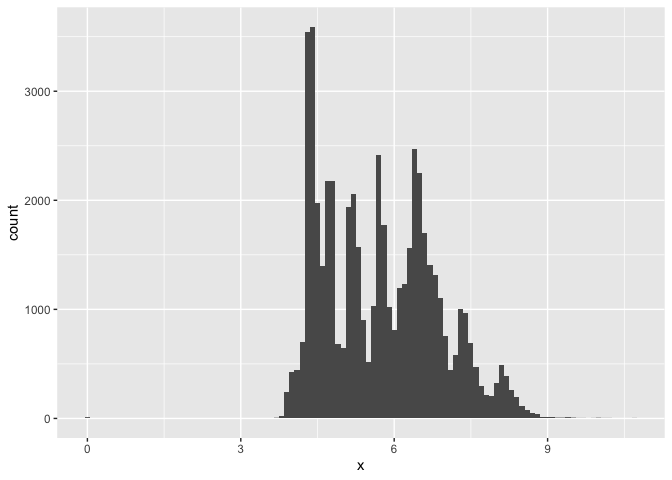<!-- -->

``` r
# Histogram for y
ggplot(diamonds, aes(x = y)) + geom_histogram(binwidth = 0.1)
```

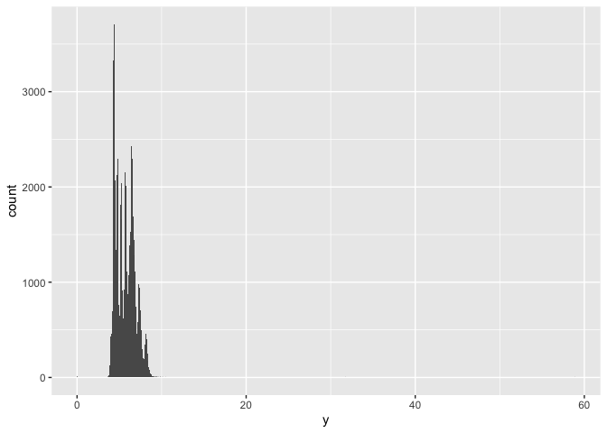<!-- -->

``` r
# Histogram for z
ggplot(diamonds, aes(x = z)) + geom_histogram(binwidth = 0.1)
```

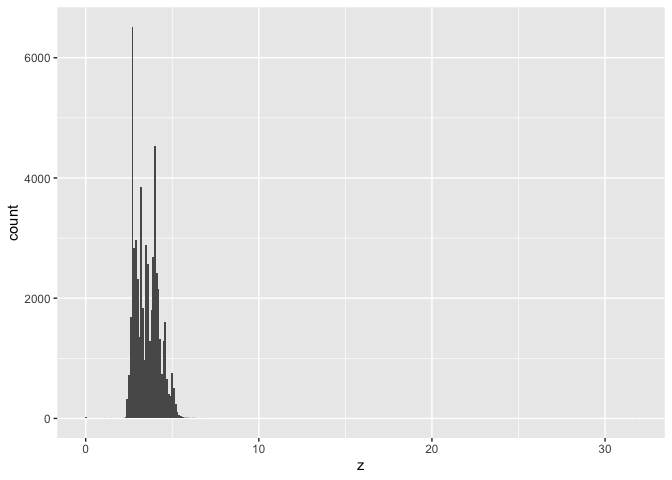<!-- -->

From exploring the distribution of the x, y, and z variables, we learn that the x and y values are mostly from 4-7, and z is mostly from 2.9 to 4. There also appear to be outliers or incorrect values, as there are zeros as min values and very large numbers as max values (58.9, 31.8). We can see that x and y are usually very close in value, so they are likely width and length, because diamonds are usually cut symmetrically. z likely represents the diamonds’ depth, as diamonds are usually relatively flat compared to their length and width.

### Question 2: Explore the distribution of price. Do you discover anything unusual or surprising? (Hint: Carefully think about the binwidth and make sure you try a wide range of values.)

``` r
summary(diamonds$price)
```

    ##    Min. 1st Qu.  Median    Mean 3rd Qu.    Max. 
    ##     326     950    2401    3933    5324   18823

``` r
# Histogram for price, binwidth 0.1
ggplot(diamonds, aes(x = x)) + geom_histogram(binwidth = 0.1)
```

<!-- -->

``` r
# Histogram for price, binwidth 0.25 
ggplot(diamonds, aes(x = x)) + geom_histogram(binwidth = 0.25)
```

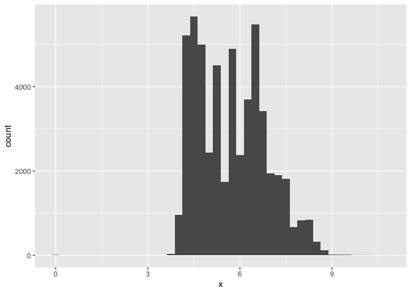<!-- -->

``` r
# Histogram for price, binwidth 0.5 
ggplot(diamonds, aes(x = x)) + geom_histogram(binwidth = 0.5)
```

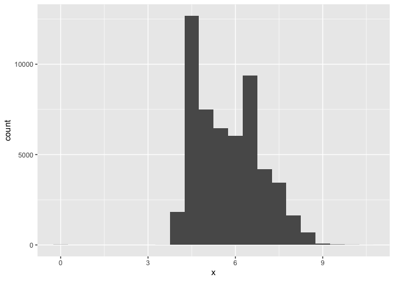<!-- -->

``` r
# Histogram for price, binwidth 1
ggplot(diamonds, aes(x = x)) + geom_histogram(binwidth = 1)
```

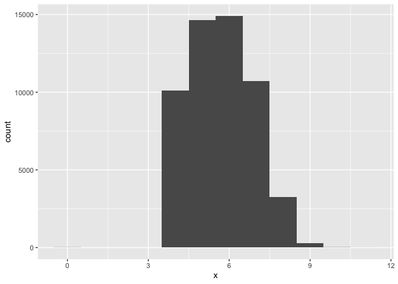<!-- -->

Price does not appear to be normally distributed at binwidth 0.1, 0.25, or 0.5. I started at 0.1 as a default, but the histogram was too peaky, obscuring the main trends in the data. 0.25 was also too peaky, so I decided that 0.5 was the most useful to visualize the trends without obstructing smaller features in the distribution of the data as binwidth of 1 might. I also tried binwidth of 1 just to check, and it made the data appear much more normal, hiding the large peak at x=8 that can be seen at smaller binwidths.

### Question 3: How many diamonds are 0.99 carat? How many are 1 carat? What do you think is the cause of the difference?

``` r
sum(diamonds$carat==0.99)
```

    ## [1] 23

``` r
sum(diamonds$carat==1)
```

    ## [1] 1558

23 diamonds are 0.99 carat and 1558 diamonds are 1 carat. There is probably such a big difference due to marketing. 1 carat diamonds sound more attractive, so more people would want to buy 1 carat diamonds, so jewelers likely cut diamonds in a way that ensures the diamond is 1 carat.

### Question 4: Compare and contrast coord_cartesian() vs. xlim() or ylim() when zooming in on a histogram. What happens if you leave binwidth unset? What happens if you try and zoom so only half a bar shows?

``` r
# Histogram with coord_cardesian with ylim
ggplot(diamonds, aes(x = x)) + geom_histogram(binwidth = 0.5)+coord_cartesian(ylim=c(0,50))
```

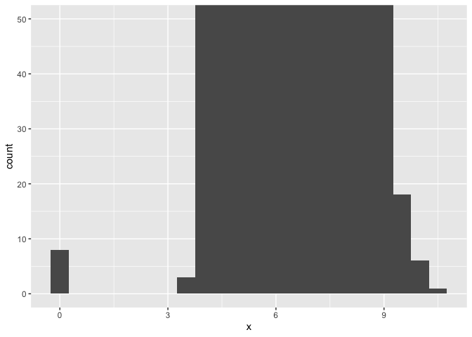<!-- -->

``` r
# Histogram with coord_cardesian with xlim
ggplot(diamonds, aes(x = x)) + geom_histogram(binwidth = 0.5) + coord_cartesian(xlim=c(0,10))
```

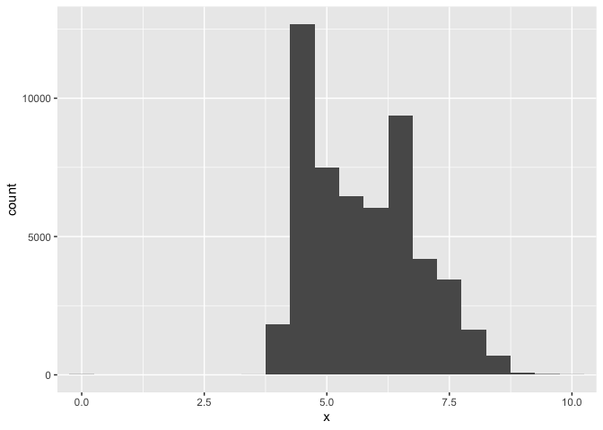<!-- -->

``` r
#Leaving binwidth unset
ggplot(diamonds, aes(x = x)) + geom_histogram()
```

    ## `stat_bin()` using `bins = 30`. Pick better value with `binwidth`.

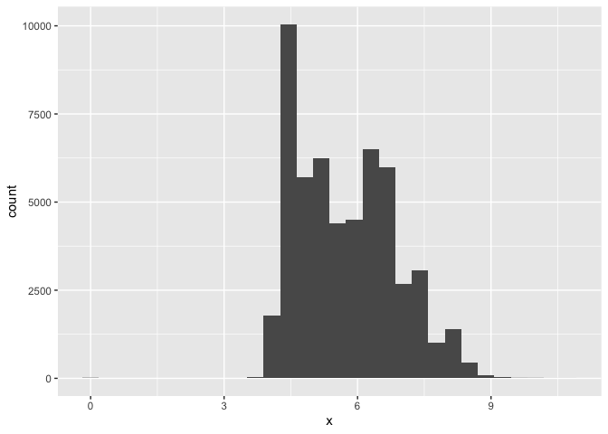<!-- -->

``` r
#Zoom so only half a bar shows 
ggplot(diamonds, aes(x = x)) + geom_histogram(binwidth = 0.5)+coord_cartesian(xlim=c(2,4))
```

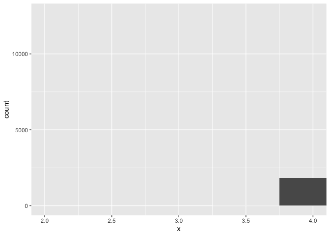<!-- -->

coord_cartesian() allows us to zoom in on small values of the y or x axis. When using it with ylim, it is useful here because it allows us to see the values at x=0. In contrast, xlim, which allows us to zoom into the x-axis, is less useful here because most of the data is concentrated in a certain area.

When binwidth is left unset, it goes to the default which is the range of the data/30. This is a smaller number than the 0.5 I used above, and provides us with thinner bins. Here, we can see more of the nuances of the data with its different dips and peaks.

I was able to zoom so only half a bar showed, but this graph did not really show anything.

## 10.4.1 Exercises

### Question 1: What happens to missing values in a histogram? What happens to missing values in a bar chart? Why is there a difference in how missing values are handled in histograms and bar charts?

``` r
library(forcats)

# Diamonds dataset does not have NA values, so we need to ntroduce some
diamonds_na <- diamonds %>%
  mutate(
    carat = ifelse(row_number() %% 50 == 0, NA, carat),  # Add some NAs to carat
    cut = as.factor(ifelse(row_number() %% 30 == 0, NA, cut))     # Add some NAs to cut
  )

# Histogram: Missing values in carat are excluded
ggplot(diamonds_na, aes(x = carat)) +
  geom_histogram(binwidth = 0.1) +
  labs(title = "Histogram of Carat (with NAs)", x = "Carat", y = "Count")
```

    ## Warning: Removed 1078 rows containing non-finite outside the scale range
    ## (`stat_bin()`).

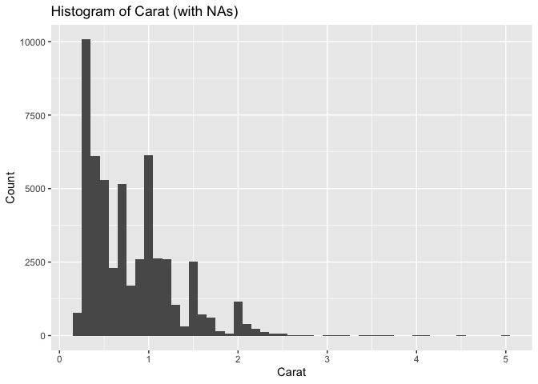<!-- -->

``` r
# Bar chart: Missing values in cut appear as a separate bar
ggplot(diamonds_na, aes(x = fct_explicit_na(cut, na_level = "Missing"))) + labs(title = "Bar Chart of Cut (with NAs)", x = "Cut", y = "Count")
```

    ## Warning: `fct_explicit_na()` was deprecated in forcats 1.0.0.
    ## ℹ Please use `fct_na_value_to_level()` instead.
    ## This warning is displayed once every 8 hours.
    ## Call `lifecycle::last_lifecycle_warnings()` to see where this warning was
    ## generated.

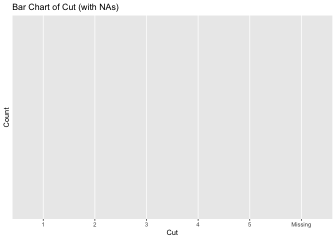<!-- -->

Missing values are excluded entirely from histograms because they require numeric values to group the values into bins. In contrast, missing values may be included as a separate category in bar charts because bar charts treat each category as a label, so “Missing” can be treated as another category. This difference in the handling of missing values is because of data type: histograms deal with numerical data while bar charts deal with categorical data.

In the above code, I added missing values to the dataset and made a histogram and barchart with the new data. Comparing these graphs to the graphs above without the missing values, we can see that the histogram does not change because the missing values are excluded, but the bar chart is impacted because it treats the missing values as another category.

### Question 2: What does na.rm = TRUE do in mean() and sum()?

``` r
#For mean
mean(diamonds$x)
```

    ## [1] 5.731157

``` r
mean(diamonds$x, na.rm=TRUE)
```

    ## [1] 5.731157

``` r
#For sum
sum(diamonds$x)
```

    ## [1] 309138.6

``` r
sum(diamonds$x, na.rm=TRUE)
```

    ## [1] 309138.6

na.rm removes any NA or missing values before calculating the mean or sum, but in this case it did not impact the mean of x (still 5.731157) or the sum of x, so that means that the diamonds dataset does not contain NA’s or missing values.

### Question 3: Recreate the frequency plot of scheduled_dep_time colored by whether the flight was cancelled or not. Also facet by the cancelled variable. Experiment with different values of the scales variable in the faceting function to mitigate the effect of more non-cancelled flights than cancelled flights.

``` r
#Facet wrap with scales = "free_y"
flights |> 
  mutate(
    cancelled = is.na(dep_time),
    sched_hour = sched_dep_time %/% 100,
    sched_min = sched_dep_time %% 100,
    sched_dep_time = sched_hour + (sched_min / 60)
  ) |> 
  ggplot(aes(x = sched_dep_time)) + 
  geom_freqpoly(aes(color = cancelled), binwidth = 1/4) +
  facet_wrap(~cancelled, scales = "free_y") + 
  labs(
    title = "Scheduled Departure Time by Cancellation Status",
    x = "Scheduled Departure Time (Hour)",
    y = "Flight Count"
  ) +
  theme_minimal()
```

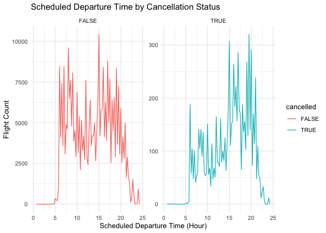<!-- -->

``` r
#Facet wrap with scales = "free"
flights |> 
  mutate(
    cancelled = is.na(dep_time),
    sched_hour = sched_dep_time %/% 100,
    sched_min = sched_dep_time %% 100,
    sched_dep_time = sched_hour + (sched_min / 60)
  ) |> 
  ggplot(aes(x = sched_dep_time)) + 
  geom_freqpoly(aes(color = cancelled), binwidth = 1/4) +
  facet_wrap(~cancelled, scales = "free") + 
  labs(
    title = "Scheduled Departure Time by Cancellation Status",
    x = "Scheduled Departure Time (Hour)",
    y = "Flight Count"
  ) +
  theme_minimal()
```

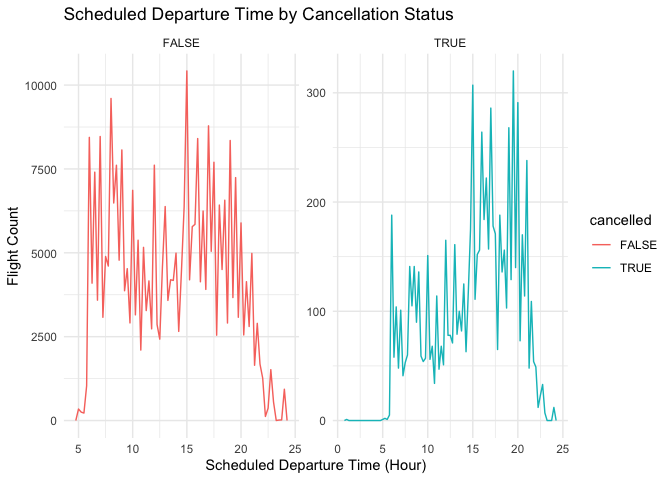<!-- -->

``` r
#Facet wrap with scales = "fixed"
flights |> 
  mutate(
    cancelled = is.na(dep_time),
    sched_hour = sched_dep_time %/% 100,
    sched_min = sched_dep_time %% 100,
    sched_dep_time = sched_hour + (sched_min / 60)
  ) |> 
  ggplot(aes(x = sched_dep_time)) + 
  geom_freqpoly(aes(color = cancelled), binwidth = 1/4) +
  facet_wrap(~cancelled, scales = "fixed") + 
  labs(
    title = "Scheduled Departure Time by Cancellation Status",
    x = "Scheduled Departure Time (Hour)",
    y = "Flight Count"
  ) +
  theme_minimal()
```

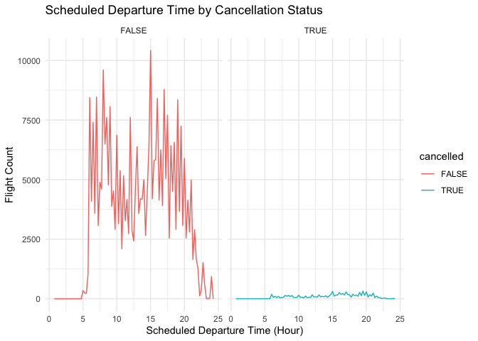<!-- -->

Because there are much fewer cancelled flights than non-cancelled, the y-axis scale on the cancelled plot would be tiny if we kept the y-axis fixed, so setting scales = “free_y” allows each facet to have its own y-axis scale, making patterns easier to see in both groups.

Setting scales = “fixed” gives us the same x and y scales for both plots, making it hard to see cancelled flights clearly.

Setting scales = “free” allows each facet to have its own x and y axis scale, which is unnecessary here since x-axis is time which is the same for both.
